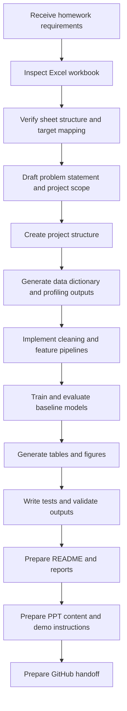

# Agent Workflow

This project is designed to demonstrate end-to-end AI-agent assistance for an interview homework submission.

## Workflow summary

The agent-assisted process covers:

1. requirement analysis
2. dataset inspection
3. schema verification
4. project planning
5. code generation
6. debugging and testing
7. analysis execution
8. reporting and visualization
9. presentation preparation

## What the agent does

### 1. Requirement analysis

- parse the homework prompt
- extract explicit deliverables and constraints
- enforce the rule that all generated artifacts stay inside the project directory
- identify actions that require human approval

### 2. Dataset-first verification

- inspect the Excel workbook before designing the pipeline
- verify sheet names, shapes, and column headers
- infer the data dictionary from actual workbook content
- verify the mapping between dataset columns and the six toxin targets from the prior study
- document uncertainty explicitly where labels do not match perfectly

### 3. Project design

- propose a realistic interview-homework scope
- define the file tree and module boundaries
- choose pragmatic baseline methods centered on SVR
- keep the implementation reproducible, readable, and demo-friendly

### 4. Code generation

- create modular Python source files
- implement profiling, cleaning, feature grouping, modeling, evaluation, and reporting
- keep scripts runnable from the terminal

### 5. Debugging and testing

- add lightweight unit tests for core pipeline logic
- run the pipeline and inspect errors systematically
- revise code and documentation based on actual execution results

### 6. Documentation and presentation

- generate README and reproducibility instructions
- produce tables, figures, and markdown reports
- prepare PPT-ready narrative for question description, solution overview, agent workflow, and demo result

## Human-in-the-loop checkpoints

The workflow keeps the human in control for sensitive or external actions.

### Human approval required for

- package installation
- GitHub repository creation
- remote push
- commands outside the project scope

### Human approval not required for

- reading and analyzing the local dataset
- creating project files inside the project directory
- generating code, tests, reports, and presentation materials locally

## Mermaid workflow

## Deliverable linkage

The workflow is intentionally aligned with the expected submission artifacts.

- `docs/problem_statement.md` ← requirement analysis + verified problem framing
- `outputs/reports/data_dictionary_inference.md` ← schema verification
- `src/` ← implementation modules
- `tests/` ← reliability and reproducibility checks
- `outputs/` ← analysis evidence and demo artifacts
- `README.md` ← setup and usage guide
- `ppt/` ← interview presentation materials

## Why this workflow is interview-friendly

- it starts from real data inspection instead of assumptions
- it shows disciplined AI-agent use across the full lifecycle
- it prioritizes clarity and reproducibility over overengineering
- it produces a clean GitHub-ready submission with visible intermediate evidence
